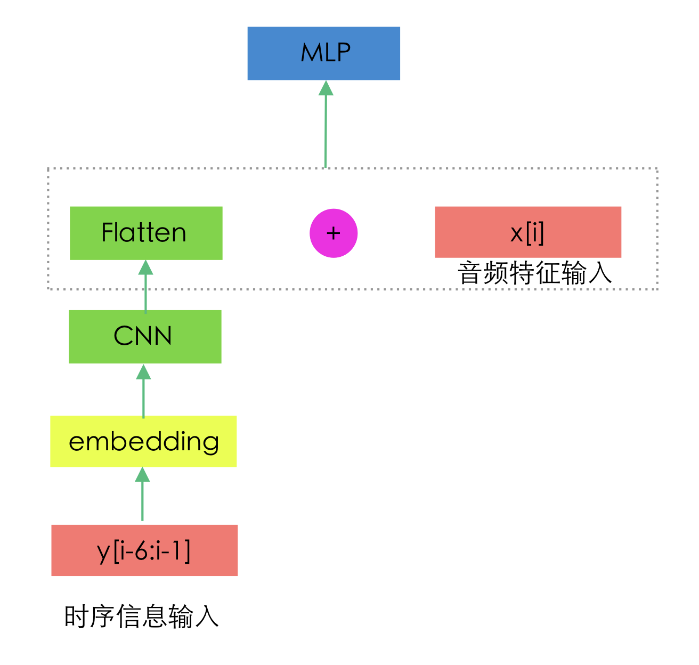

# AI_dance3_beatmap_converter
舞立方谱面AI生成，malody格式。

### 说明
需要基于一个已有的谱面，比如说4k，然后转谱成舞立方的谱面。

### 预处理
见：`1_dataset_creation.ipynb`

```
pip install audiodiffusion
```

### 模型1



- 训练：2_model_train1.ipynb
- 预测：3_beatmap_generate1.ipynb

### 其他模型
待补充。。。


### LICENSE
Apache License 2.0